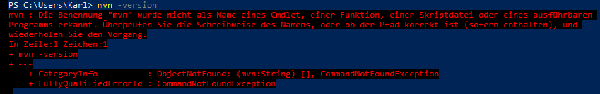
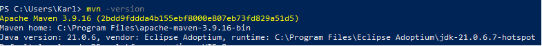
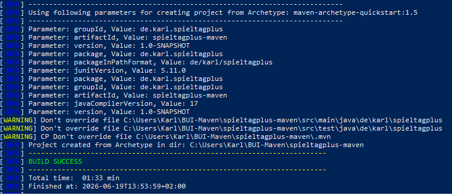
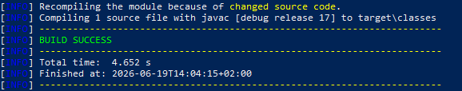
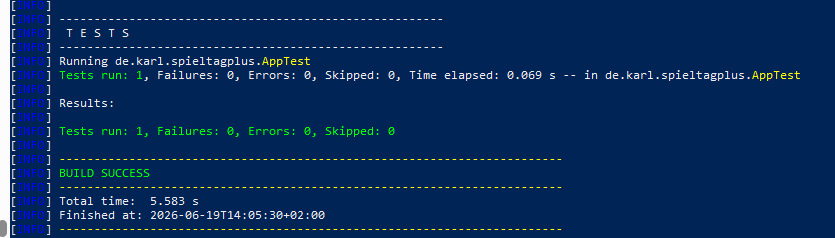
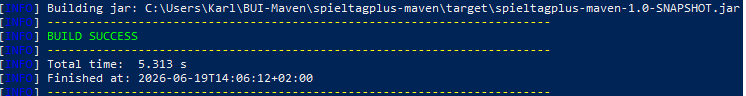
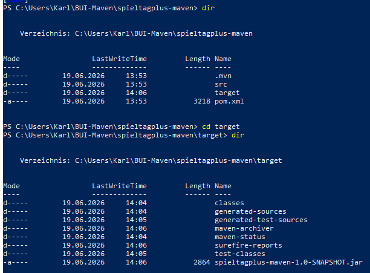

# Buildmanagement

## MAVEN

### Maven Installation und Start
Kurz gecheckt, ob Mavel schon auf meinem PC installiert ist, keien Versionsnumemr also negativ:

Neustes Release auf https://maven.apache.org/ heruntergeladen und installiert.
Danach habe ich auch die Umgebunsgsvariablen MAVEN_HOME und PATH angepasst, damit Windows den Befehl mvn findet und Maven über die Konsole ausführen.

Zwizter Check zeigt, dass Maven erfolgreicht inatslliert wurde und JDK21 verwendet.

### Maven-Projekt
Projekt mit folgenden Projektparametern erstellt und Standardstrutkur inklusive pom.xnl erzeugt.

### Maven-Tasks

Quellcode kompiliert mit "mvn compile", Build erfolgreich ausgeführt.

Dann mit "mvn test" die automazisch erzeugten JUnit-Tests ausgeführt. Alle erfolgreich abgeschlossen.

Schließlich habe ich das Projekt paketiert und eine ausführbare Datei "spieltagplus-maven-1.0-SNAPSHOT.jar" erzeugt.

Diese wurde im Verzeichnis "target" abgelegt:

### Fazit
Positive Erfahrungen. Die Build-Befehle compile, test und package funktionierten auf Anhieb problemlos. Klare, übersichtliche Projektstruktur über pom.xml. 

