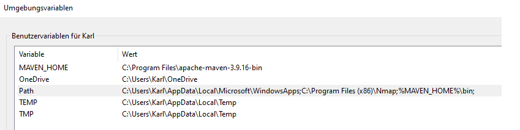
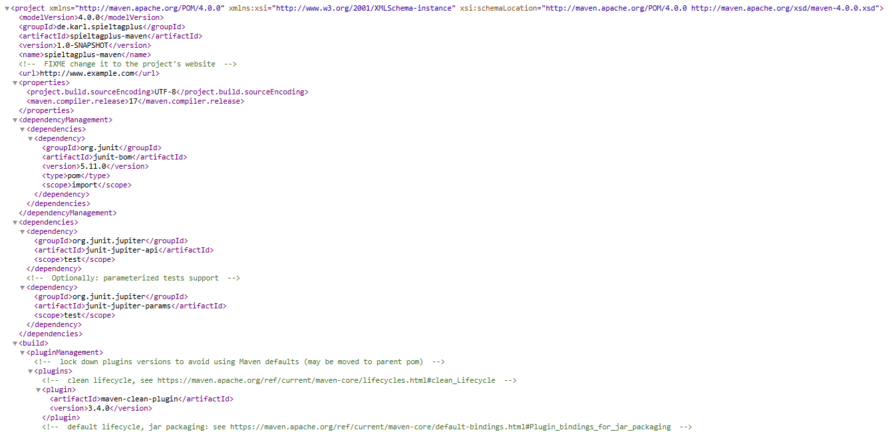
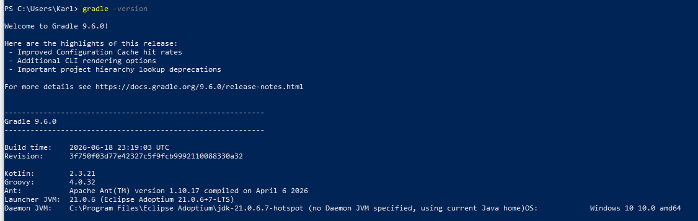
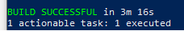
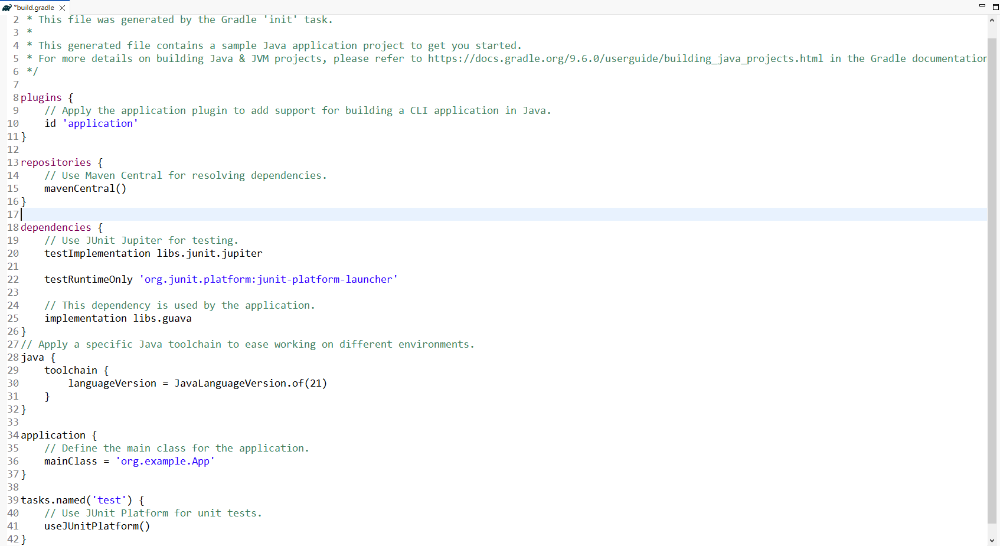
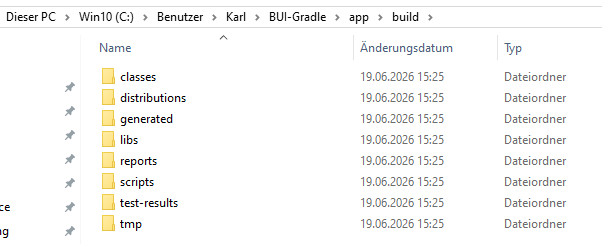
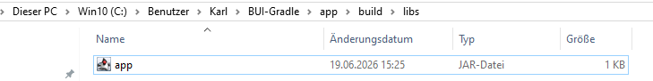

# Buildmanagement

## MAVEN

### Maven Installation und Start
Kurz gecheckt, ob Mavel schon auf meinem PC installiert ist, keine Versionsnummer vorhanden, also negativ:

Neustes Release auf https://maven.apache.org/ heruntergeladen und installiert.
Danach habe ich auch die Umgebunsgsvariablen MAVEN_HOME und PATH angepasst, damit Windows den Befehl mvn findet und Maven über die Konsole ausführen.

Zweiter Check zeigt, dass Maven erfolgreicht inatslliert wurde und JDK21 verwendet.

### Maven-Projekt
Projekt mit folgenden Projektparametern erstellt und Standardstrutkur inklusive pom.xml erzeugt.

### Maven-Tasks

Quellcode kompiliert mit "mvn compile", Build erfolgreich ausgeführt.

Dann mit "mvn test" die automazisch erzeugten JUnit-Tests ausgeführt. Alle erfolgreich abgeschlossen.

Schließlich habe ich das Projekt paketiert und eine ausführbare Datei "spieltagplus-maven-1.0-SNAPSHOT.jar" erzeugt.

Diese wurde im Verzeichnis "target" abgelegt:

### Fazit
Positive Erfahrungen. Die Build-Befehle compile, test und package funktionierten auf Anhieb problemlos. Klare, übersichtliche Projektstruktur über pom.xml, die den Build-Prozess steuert. 
Hier ein Ausschnitt daraus: 

## GRADLE

### Gradle Installation und Start

Kurz wieder gecheckt, ob Gradle tatsächlich noch nicht installiert ist mit "gradle -version".
War nicht der Fall, also installiert und wieder wie bei Maven die Umgebungsvariablen ergänzt und nun version anzeigen lassen: 

### Gradle Projekt

Ich habe zum Ausprobieren ein neues Java-Project erstellt mit dem Gradle-Initalisieurngsassistenten "gradle init":

Projektart: Application Programmiersprache: Java Build Script DSL: Groovy Test Framework: JUnit Jupiter Projektname: spieltagplus-gradle
Porjekt wurde erfolgreich erstellt und die Standardstruktur erstellt.

### Gradle-Build-Skript

Das zentrale Build-Skript von Gradle ist die Datei `build.gradle`, diese wird für die automatische Ausführung des gesamten Build-Prozesses verwendet. 

Hier sieht man Folgendes:

- das verwendete Application-Plugin
- das Repository Maven Central
- externe Abhängigkeiten (JUnit, Guava)
- verwendete Java-Version (Java 21)
- Main-Klasse
- Testkonfiguration

### Build ausgeführt
Befehl "gradle build" verwendet, erfolgreich Quellcode kompiliert.

Im Verzeichnis build wurden folgende Verzeichnisse erzeugt:

Und im Verzeichnis libs die JAR-Datei abgelegt. App-Jar ist somit das Ende des Build-Prozesses.

### Fazit

Auch das Experementieren mit Gradle war direkt erfolgreich. Keine Probleme. Die Konfiguration über "build.gradle" ist kompakter und besser lesbar als bei Maven. 
Durch die Skripte in der DSL gibt es hier mehr flexible Anpassungsmöglichkeiten.

